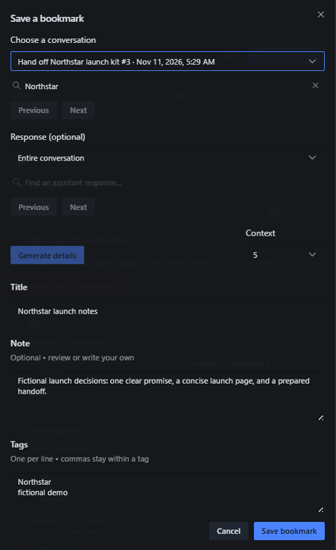
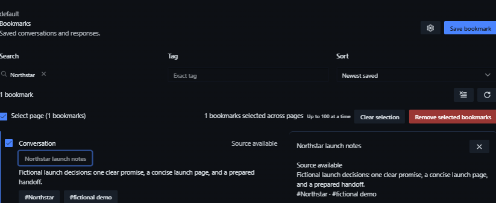

# Conversation Bookmarks

**Come back to the part that mattered.**

Contest candidate. [Verified workflows and known issues](docs/RELEASE_STATUS.md).

Give a useful Hermes conversation or assistant response a title, a note, and a way back. Find the decision you made, the explanation that clicked, or the thread you want to continue.

[Install](docs/INSTALLATION.md) · [Usage guide](docs/USAGE.md) · [Commands](docs/COMMANDS.md) · [Security](SECURITY.md)


<picture>
  <source media="(prefers-color-scheme: dark)" srcset="docs/assets/mark-on-dark.png">
  
</picture>

## Watch it work

[Conversation Bookmarks launch film · 36 seconds](docs/assets/launch.mp4) · [Both plugins together · 42 seconds](docs/assets/saved-together.mp4)

Real dark-mode native screens, fictional Northstar notes. The films show saved references and the source-return control, not a transcript backup or a continuous recording.

## Save the reference, add the reason

A bookmark stores a conversation reference and your annotations. You can bookmark an entire conversation or identify an assistant response within it.

Name the bookmark for what you will look for later. “Friday launch decision” is more useful than “Interesting chat.” Add a note for the detail you do not want to reconstruct next time.

Use it for:

- The decision and reasoning behind a project change.
- An explanation you want to revisit instead of asking again.
- A conversation you intend to continue after switching tasks.
- A particular assistant response worth keeping track of.

Bookmarks does not copy the transcript, infer persistent memory, or preserve attached files. It keeps your place, not a second conversation archive.

## Install

### Native Hermes Desktop

Open **Capabilities → Plugins → Install from Git** and enter:

```text
https://github.com/mechkw/hermes-conversation-bookmarks
```

Choose the intended backend and profile, review installation permissions, and enable both the **Agent** and **Desktop** halves. Open **Saved → Bookmarks**.

### Backend or web Dashboard

Run on the backend that owns your Hermes profile:

```sh
hermes plugins install mechkw/hermes-conversation-bookmarks --enable
hermes plugins list
```

Use the installer's activation result to check whether anything still needs a reload. Installing the backend alone does not install a native Desktop UI on another computer.

[Full installation guide](docs/INSTALLATION.md), including remote backends and host compatibility.

## Save your first bookmark

In **Saved → Bookmarks**, choose **Save bookmark**. You can also open the collection from native Desktop's **Plus → Bookmarks** entry:

1. Choose a conversation by title and date.
2. Leave **Entire conversation** selected, or choose an assistant response.
3. Enter a title, optional note, and tags.
4. Select **Save bookmark**.

No session IDs to copy for the normal chooser workflow.



*Fictional Northstar demonstration. The details are ready for review; the bookmark has not yet been saved.*

For a selected response, **Generate details** drafts a title, note, and tags using your configured model. Review the draft before saving. Generation is optional and never saves the bookmark by itself.

From a current Hermes conversation, you can also enter:

```text
/bookmark Friday launch decision #launch, planning --description "Friday stays; scope is reduced."
```

Supplying title, tags, and description saves directly. Omitted fields ask the current Hermes agent to complete them, subject to host support and explicit handoff permission. Bare `/bookmark` keeps its original meaning: **save the current conversation**, not open a browsing menu.

Browse from chat with `/bookmarks` or `/bookmark browse`. Use `/bookmarks browse launch` to search saved annotations. Both command names support explicit `add` and `help` forms. Configured Telegram connections offer a native bookmark panel with a separate confirmation before saving a conversation reference.

[Command syntax, Telegram panels, and assisted-save setup](docs/COMMANDS.md).

## Browse without losing your place

Search saved titles, notes, and tags. Filter by an exact tag, then sort by newest saved, oldest saved, or title.

Choose a bookmark title to inspect its note, tags, source status, and resume information beside the collection. Checkboxes select bookmarks for removal; they do not open the inspector. Page selection is labeled by scope, and selections can span pages.



*One bookmark selected for metadata removal, with its source still available. Inspection and checkbox selection are separate actions.*

Use **Open conversation** in native Desktop to resume an available source. A response reference identifies what you saved, but opening resumes the conversation; it does not promise to scroll to that exact response. The web Dashboard offers the source ID and a profile-qualified terminal resume command.

## Your annotations survive a missing source

If a source conversation or response is pruned or removed, the bookmark remains with an unavailable-source status. You can still edit its title, note, and tags, retain the old reference, or remove the bookmark.

Bookmarks cannot restore the missing transcript. Removing one or several bookmarks deletes only their metadata, never the original conversations or messages.

Revision checks reject stale edits and removals instead of silently overwriting a newer change. [Edit, remove, and handle missing sources](docs/USAGE.md#edit-or-remove-bookmarks).

## Privacy and generation

The bookmark catalog is local to the selected Hermes **backend profile**. On a remote setup, that means the server that owns the profile.

- Saving is deliberate. There is no automatic capture or plugin analytics service.
- Collection search covers bookmark annotations, not full conversation text.
- Source choosers read bounded conversation metadata and assistant-response previews on request.
- **Generate details** sends the selected response and bounded preceding context through Hermes's configured provider. Later conversation content is excluded.
- An assisted slash-command save uses the current agent's context. It is a different workflow from the editor's draft generation.

Do not put secrets in bookmark titles, notes, or tags. This is not an encrypted vault or transcript backup. [Storage and privacy details](docs/USAGE.md#storage-and-privacy).

## The conversation and the work

Use [Delivery Shelf](https://github.com/mechkw/hermes-delivery-shelf) for the report, images, or other files a conversation produced. Use Bookmarks for the conversation or response behind them.

Either plugin works alone. With both installed, **Saved** presents **Bookmarks** and **Deliverables** together while each plugin keeps its own backend and storage.

## Help and project links

- [Usage guide](docs/USAGE.md), [command reference](docs/COMMANDS.md), and [installation](docs/INSTALLATION.md).
- [Technical reference](docs/TECHNICAL.md), [changelog](CHANGELOG.md), and [contributing](CONTRIBUTING.md).
- [Report a bug](https://github.com/mechkw/hermes-conversation-bookmarks/issues). Remove private conversation text and identifiers from reports.
- Report vulnerabilities privately using the channel in [SECURITY.md](SECURITY.md). If GitHub private reporting is unavailable, email **repobugs@virtuedev.com**. Do not post a vulnerability publicly.

An independent community plugin for [Hermes Agent](https://hermes-agent.nousresearch.com/docs/). [MIT license](LICENSE).
